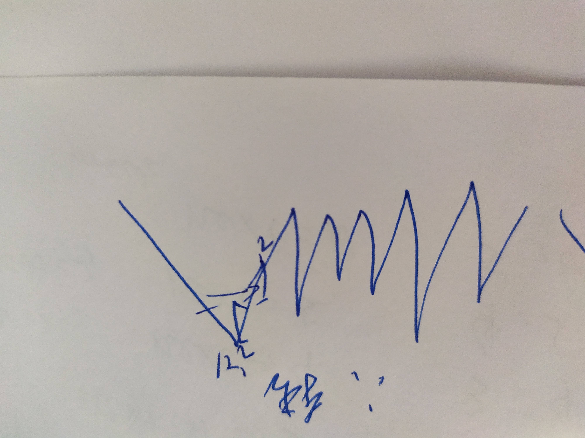

# write_more_code

## two sum
1. init vector
- `vector<int> x = vector<int>(size)`
2. 注意key和value
3. 注意放入dict的时机。

## add two numbers
1. new sth.
`pre->next = new ListNode(1);`
2. use existing`ListNode *x = l1;`


## Longest Substring Without Repeating Characters 
1. add item to set
`set.insert()`
2. remove
`set.erase()`
3. 左右指针维护

## 重写。寻找两个有序数组的中位数
奇数中位数，分界线左边有n/2个值，取右边，偶数中位数，分界线左边有n/2个值，取两边的平均。
此处二分分界线的右边。可计算出另一个数组的值为n/2-mid。

1. 为什么不二分左边
- 因为二分左边的话，要从-1 到n-1，-1作为二分值易越界。 
2. 成功条件。

3. 边界！！！
a.　其实是L的初始值，但是写着太难了。于是此处要判断n/2-mid是否为负数。是的话则mid要往小了走。
b. 边界的另外一边可能没有值，此处处理的还算优雅。OK
c.　何时往小往大。拿真实的值模拟一下。

## Longest Palindromic Substring
1. 回文，要思考中心。
2. 多画图
3. 有空重写
4. 马拉车算法


### 6. Z string
找规律题，要更快更准一点。
减少乘除运算

### 7. 
1. 初始化一个char 
       char tmp[12] = {'\0'};
2. `ans = ans * 10 + tmp[i] - '0';`会溢出, `ans = ans * 10 + (tmp[i] - '0'); ` 不会
3.　string的size不会因为'\0'被截断

### 10. reg match 
1. 转移方程还是要谨慎再谨慎啊。

### 11. container with most water
1. 左右指针的使用还不够机智。

### 15. 3sum
1. 依然是左右指针。 注意去重的方法。
2. vector的size是一个无符号数，注意不要做减法。

### 17. letter comb
1. 注意初始化。过。


### 19
1. 注意头指针被删除

### 20 pass

### 21
1. 空头指针有时候会简化问题。（todo 回顾19）
2. 只剩一个的时候不用while 直接连就好了。

### 22 pass
产生所有可能的，dfs之 

### 23 merge k sorted
1. pq的使用
- self defined compare function
```cpp
    struct cmp{
        bool operator()(ListNode* a, ListNode* b){
            return a->val > b->val; // 是否把a往后放
        }
    };
    priority_queue<ListNode*, vector<ListNode*>, cmp > pq;
```
第二个参数是container
小顶堆。 要写：是否把第一个参数往后挪。
或者重载运算符
```cpp
 9 bool operator<(Node a, Node b){//返回true时，说明a的优先级低于b
10     //x值较大的Node优先级低（x小的Node排在队前）
11     //x相等时，y大的优先级低（y小的Node排在队前）
12     if( a.x== b.x ) return a.y> b.y;
13     return a.x> b.x; 
14 }
```
- `top()` instead of `front()` -> it is a heap
2. 有空看看堆怎么写。

### 31 next permutation

1. 边界判断
2. 如何构成下一个排列：最小地提高：最后可以提高的位置：改成最小的最大值，重新使之从小变大。

### 32. longest valid parenthese
1. 注意看题。
2. 括号匹配考虑栈。
3. 计算长度考虑idx

todo:还能更优

### 33 search in rotated sorted array
1. 先找split点再分别对两段二分。（咦只要看一个是不是在去区间里就行了不用搜两次= =
2. todo 两次二分可以合并。

### 34
1. `upper_bound`返回的是下一个位置。

### 39
组合就dfs pass

### 42 trapping rain
1. 左右最大值模拟。注意更新时机 
2. todo ： 左右指针法减少空间。 https://www.cnblogs.com/qiyueliu/p/10990663.html#autoid-1-0-0

### 46 permutation
1. lowerbit https://www.cnblogs.com/qiyueliu/p/10990663.html#autoid-1-0-0

### 48 rotate 
1. 找规律，旋转一个值不变，只变位置
### 49
水题

### 53 最大子串和。
常规操作

### 55 jump game
维护最远值，不要傻乎乎。

### 56 merge intervals
1.　自定义的cmp函数，需要是static的
```cpp
    static bool cmp(vector<int>&a, vector<int>&b){
        if(a[0] == b[0]) return a[1] < b[1];
        return a[0] < b[0];
    }
```
小序

### 62 unique path
组合数学

### 64 minimum path sum
1.滚动数组小心
2. todo: 原地

### 72
1. 滚动数组 - -
2. 删除和增加本质上没有区别

### 75 sort color
1. 已经处理过的值不是0就是1

### 76 minimum window substring
1. 注意边界细节
2. todo: 还能更快？

### 78 dfs
1. dfs
2. todo: 省内存？
### 79　word search
1. 裸的dfs
2. todo: 如何更快？

### 84 largest rectangle in histogram
1. 找到小于/大于某个点最近的点的时候，要想想单调栈。
2. 模拟想一下出栈条件是什么。
3. todo： 再深入学学

### 85 Maximal Rectangle
1. h很好理解。
2. l r的更新方式。
todo：again

### 94 Binary Tree Inorder Traversal
1. 栈模拟dfs，进栈while
2. 想想后序

### 96 Unique Binary Search Trees
1. dp函数设置

### 98 Validate Binary Search Tree
1. 写的极挫。
2. 研究引用

### 101 Symmetric Tree
递归，左右右左检查是否一致。